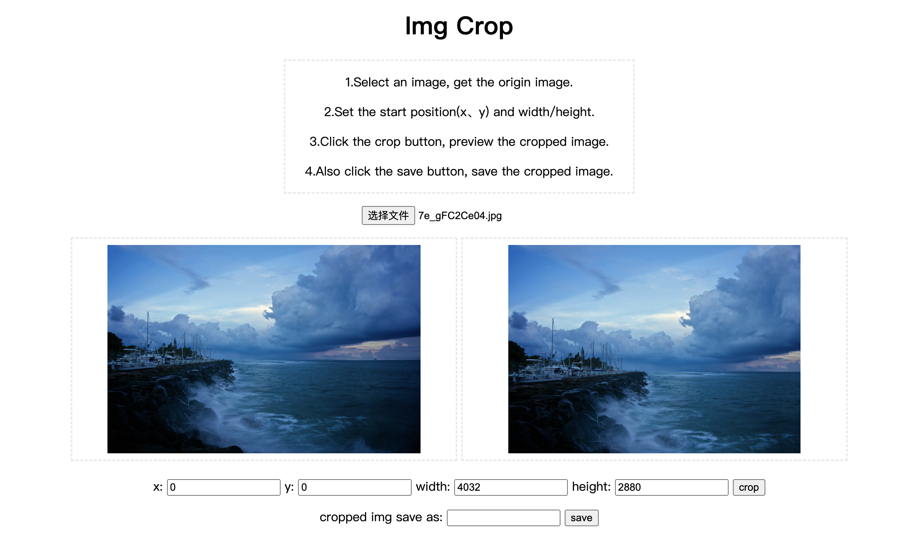

# Web Playground

Some interesting web demo.

## Crop Image

select image from local, set crop parameters,then get cropped image.

## Drag Dom

Realize dom drag with new dom attribute: draggable.   
The picture in this Demo are from Dome-1(Crop Image).
